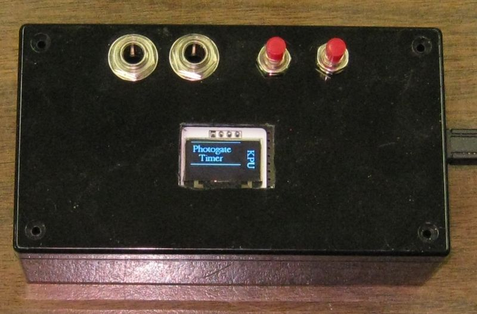
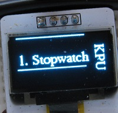
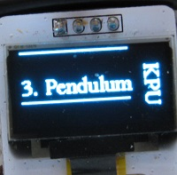
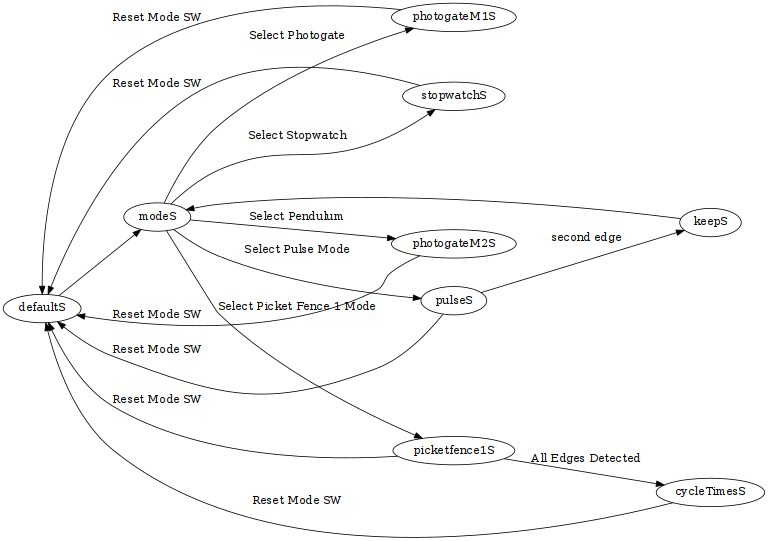
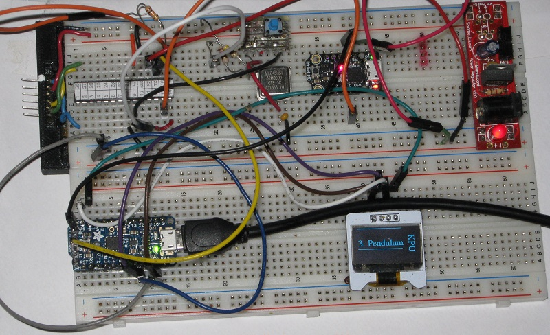
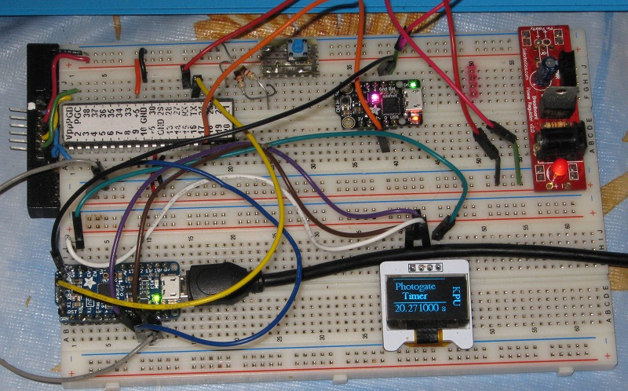

# Photogate Box

The photogate box will contain two interconnected circuits. The display terminal circuit is shown here.

The timing circuit will be added to the box soon. The PIC18F2620 is part of the timing circuit.

 *The firmware is still in development.*
 
## pickmode (master)

The pickmode branch allows selection of different operating modes. 

1. Stopwatch
2. Photogate
3. Pendulum
4. Pulse
5. Picket Fence 1

When the timer box is powered up window 1 of the display will cycle displaying possible mode selections in a repeating 
sequence. The **mode select** button allows one to select the mode.  

### Stopwatch mode

When the Stopwatch mode is selected the **mode select** button becomes the Start/Stop button.
During timing window 2 of the display shows **- - -**.
When timing is stopped the time will be displayed in window 2. Time is reset automatically if/when the Start/Stop 
button is pressed again.
The Mode Reset button will restart the timer with window 1 cycling the available modes.

### Photogate mode

The Photogate mode will time the duration between falling edges on the photogate1 input.

### Pendulum mode

The Pendulum mode is similar to Photogate mode but is displays the total period of a swinging pendulum.

### Pulse mode

The Pulse mode times the duration from falling edge to rising edge. Currently this mode runs once and returns 
to the mode selection state with the time displayed in window 2. 

### Picket Fence 1

This mode measures the duration between the first falling edge (the trigger point) and each of eight subsequent 
falling edges. None of the times are displayed until they have all been recorded. The display will then continuously 
cycle through and display each time.

## State Transition Diagram

## breadboard 

This is still at the testing stage and built on a breadboard.

Notes specific for this branch are at:

* [https://danpeirce.github.io/2018/oled-v1.2/oled-v1.2.html#pickmode2620](https://danpeirce.github.io/2018/oled-v1.2/oled-v1.2.html#pickmode2620)

The Photogate box includes a microcontroller with built-in hardware timers.

This branch is for the PIC18F2620 MCU. This branch uses an external 32 Mhz oscillator.

For now work is being done on a breadboard.

The prototype from 2014 looked like this and had a USB interface and no display.

## Source code in C

The source code for this project is in C and is licensed under the [GNU GPL v3](http://www.gnu.org/licenses/gpl-3.0.txt).

## PIC Wiring

The PIC inputs and outputs as defined in the source code.

## Microchip Documents

* [Links to Microchip Documents and Install files](doc/MicrochipDocs.md)

## Legacy Peripheral libraries

* When installing xc8 on new computer the legacy peripheral libraries must also be downloaded and installed for 
  this project. The Plib is a separate download starting with XC8 version 1.35.
  
* MPLAB-8:  **Project > Build Options > Project**, select **Linker tab**, and under Runtime options check **Link in 
  Peripheral Library.**
  
* Also add the path to the location of the peripheral libraries.
