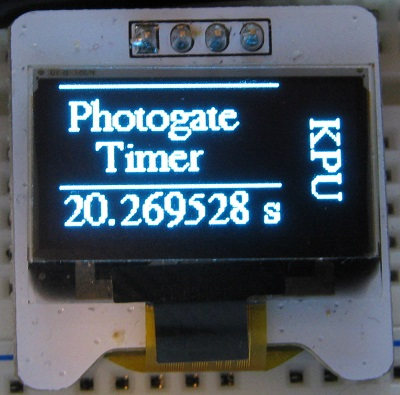

# Photogate Box

 *The firmware is still in development.*

This is still at the testing stage and built on a breadboard.

Notes specific for this branch are at:

* [https://danpeirce.github.io/2018/oled-v1.2/oled-v1.2.html#stopwatch](https://danpeirce.github.io/2018/oled-v1.2/oled-v1.2.html#stopwatch)

The Photogate box includes a microcontroller with built-in hardware timers.

This branch is for the PIC18F4525 MCU rather than the PIC18F2620. Primarily because I happen to have a PIC18F4525 
handy on a breadboard. It will make no difference to the final code. This branch  an external 32 Mhz oscillator.

For now work is being done on a breadboard.

The prototype from 2014 looked like this and had a USB interface and no display.

## Source code in C

The source code for this project is in C and is licensed under the [GNU GPL v3](http://www.gnu.org/licenses/gpl-3.0.txt).

## PIC Wiring

The PIC inputs and outputs as defined in the source code.

## Microchip Documents

* [Links to Microchip Documents and Install files](doc/MicrochipDocs.md)

## Legacy Peripheral libraries

* When installing xc8 on new computer the legacy peripheral libraries must also be downloaded and installed for 
  this project. The Plib is a separate download starting with XC8 version 1.35.
  
* MPLAB-8:  **Project > Build Options > Project**, select **Linker tab**, and under Runtime options check **Link in 
  Peripheral Library.**
  
* Also add the path to the location of the peripheral libraries.