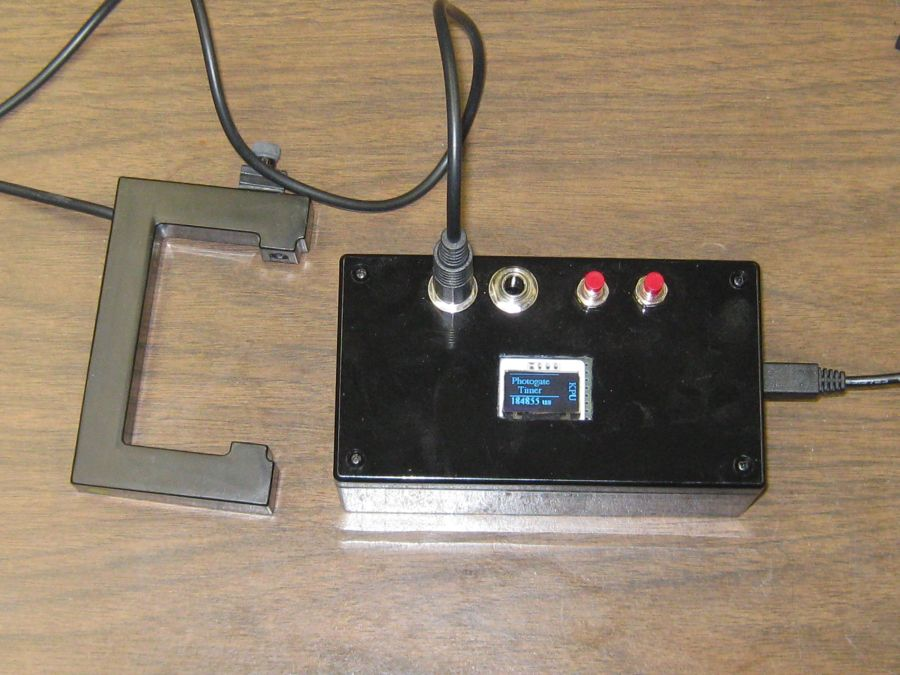
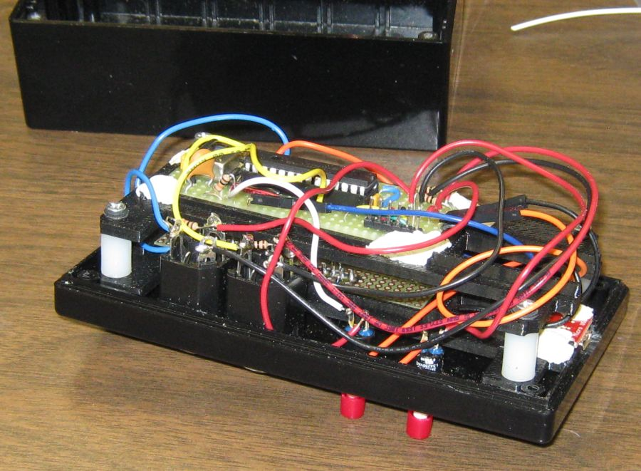
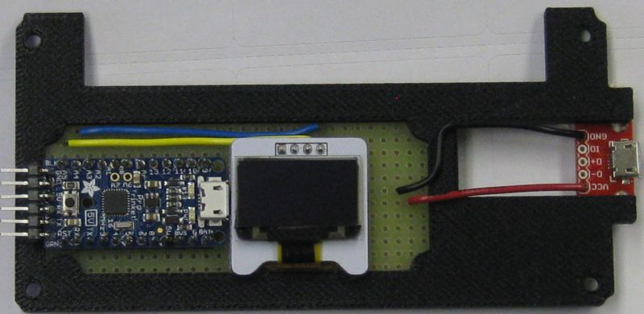
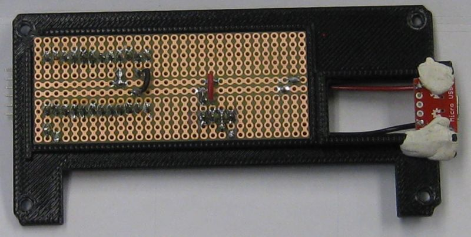
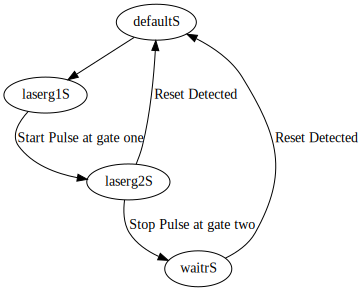

# Photogate Box

The prototype of the photogate timer box with built in termanal. 

The PIC18F2620 is part of the timing circuit which is mounted on the top board of this image showing all
mounted parts.

The photogate box contains two interconnected circuits. The display terminal circuit is shown 
here. Text and control characters is sent from the timer circuit to the terminal circuit
by the USART at 115200 bps. A list of control characters recognized is given at the link:

* [https://danpeirce.github.io/2018/oled-v1.2/oled-v1.2.html#command-codes-to-control-the-display-terminal](https://danpeirce.github.io/2018/oled-v1.2/oled-v1.2.html#command-codes-to-control-the-display-terminal)

This version of the photogate box contains two [custom 3D printed mounting brackets](https://github.com/danpeirce/pic-box-bracket) to secure the circuit boards to the box
lid.

## Only one Mode

Unlike the main branch of this project the lasergate branch has only one mode. It is lasergate.

When powered up the timer display is initially blank and then shows two splash screens in succession. The first
is the **Adafruit Splash Screen** included with the [OLED library](https://danpeirce.github.io/2018/oled-v1.2/oled-v1.2.html#switching-to-current-adafruit-libraries-may-20-2018) that runs on the terminal
[forked on github](https://github.com/danpeirce/Adafruit_SSD1306/tree/terminal) for this project. The second splash screen shown after the first is the
**KPU Photogate Timer** splash screen. After the Photogate timer 
splash screen the displays the first 0 ms is added to the bottom portion of the display. Once 0 ms is showing in the display the unit
is ready for a timing event on the photogate #1 input. Once the start laser beam is interrupted the display with show an incrementing time approximation.
When the stop laser beam is interupted (photogate #2 input) the approximate running time is replaced with time read from the internal hardware timer.
At this point the system will ignore laser inputs until the reset button is pressed.

### State Tranition Diagram

## Previous Project

The prototype from 2014 looked like this and had a USB interface and no display.

## Source code in C

The source code for this project is in C and is licensed under the [GNU GPL v3](http://www.gnu.org/licenses/gpl-3.0.txt).

## PIC Wiring

The PIC inputs and outputs as defined in the source code.

## Microchip Documents

* [Links to Microchip Documents and Install files](doc/MicrochipDocs.md)

## Legacy Peripheral libraries

* When installing xc8 on new computer the legacy peripheral libraries must also be downloaded and installed for 
  this project. The Plib is a separate download starting with XC8 version 1.35.
  
* MPLAB-8:  **Project > Build Options > Project**, select **Linker tab**, and under Runtime options check **Link in 
  Peripheral Library.**
  
* Also add the path to the location of the peripheral libraries.
