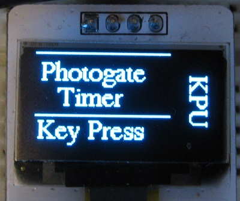
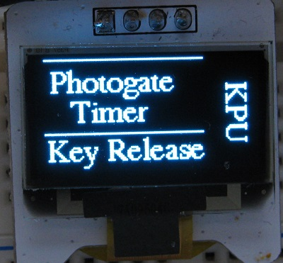

# Photogate Box

In this branch the display simply indicates when a pushbutton switch has been pressed.

The photogate ~~Box~~ *timer* is intended to act as a photogate timer with a display. This is a work in progress and
considerable modification of old projects will be necessary for the new user interface which will now be switches 
and a SSD1306 display terminal. Notes on the display terminal are available at 
[https://danpeirce.github.io/2018/oled-v1.2/oled-v1.2.html](https://danpeirce.github.io/2018/oled-v1.2/oled-v1.2.html).

Notes specific for this branch are at:

* [https://danpeirce.github.io/2018/oled-v1.2/oled-v1.2.html#keypress](https://danpeirce.github.io/2018/oled-v1.2/oled-v1.2.html#keypress)

**The process if changing the code is only just beginning (as of June 24, 2018).**

The Photogate box includes a microcontroller with built-in hardware timers.

For more [information on what a photogate is *link*](https://answers.yahoo.com/question/index?qid=20080614212815AAqek64).

This branch is for the PIC18F4525 MCU rather than the PIC18F2620. Primarily because I happen to have a PIC18F4525 
handy on a breadboard. It will make no difference to the final code. I did not have an external oscillator handy 
so this initial testing is being done with the internal oscillator.

For now work is being done on a breadboard.

The prototype from 2014 looked like this and had a USB interface and no display.

## Source code in C
The source code for this project is in C and is licensed under the [GNU GPL v3](http://www.gnu.org/licenses/gpl-3.0.txt).
See the file PhotogateLV.c

## Prototype project from 2006. 

> Some changes have been made that were not included in the notes at the link given below. Details
will be added to this README.md file to reflect the photogate timer box as is currently used.

* [Photogate Box Notes from 2006-2007](https://danpeirce.github.io/2006/timer_box/index.html)

## PIC Wiring

The PIC inputs and outputs as defined in the source code.

## Microchip Documents

* [Links to Microchip Documents and Install files](doc/MicrochipDocs.md)

## Legacy Peripheral libraries

* When installing xc8 on new computer the legacy peripheral libraries must also be downloaded and installed for 
  this project. The Plib is a separate download starting with XC8 version 1.35.
  
* MPLAB-8:  **Project > Build Options > Project**, select **Linker tab**, and under Runtime options check **Link in 
  Peripheral Library.**
  
* Also add the path to the location of the peripheral libraries.